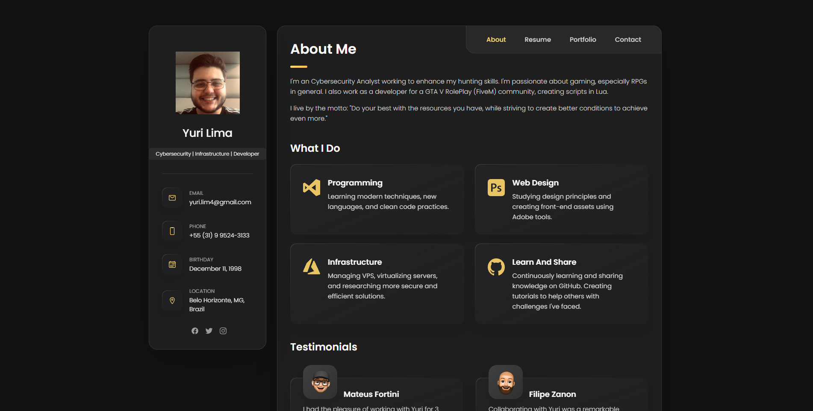

# 📑 Portifolio 1.0

<p align="center">
  
</p>

<p align="center">
  
  
  

</p>

## 📋 Sobre o Projeto

Um portifólio geral para apresentação de sua carreira. Contém espaço para Projetos, skills, contato e até testemunhos de quem trabalhou com você. O Código e 100% aberto para quem quiser utilizar.
[Link do Site](https://portifolio-p2.netlify.app/) <br>-*Quem criou a poltrona se inspirou na cadeira.*

## 📂 Estrutura do Projeto

```
Portifolio1.0/
├── assets/           # Pasta que contém arquivos
│   ├── css/          # Toda estilização do projeto
│   ├── images/       # Imagens utilizadas no portifólio
│   ├── js            # JS para slides, autoscroll e contadores
│   └── php/          # PHP para mailer do site
└── ...
```
## 👨‍💻 Autor

Desenvolvido por Yuri Ponce

[](https://www.linkedin.com/in/yurilim4/)

---

<p align="center">
  <i>Faça o seu melhor nas condições que tem, até ter condições para fazer melhor ainda.</i>
</p>